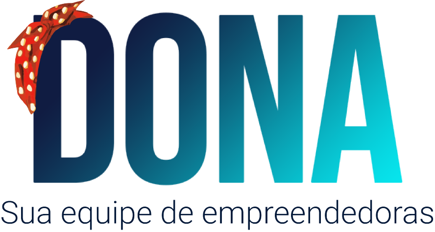

<h4 align="center">

 Encontre mulheres prontas para empreender 👷‍♀️👩‍🏫👩‍💼👩‍🔬 

</h4>

# 👩‍🔬 Overview
Uma das maiores dificuldades de mulheres que decidem empreender no mercado de tecnologia é encontrar outras representações femininas com os mesmos ideais e habilidades complementares para embarcarem juntas no desenvolvimento de algum projeto.

Uma rede composta apenas por mulheres e para mulheres, com ideia de proporcionar networking entre idealizadoras e investidores e capacitação para as mulheres (roadmap futuro).
